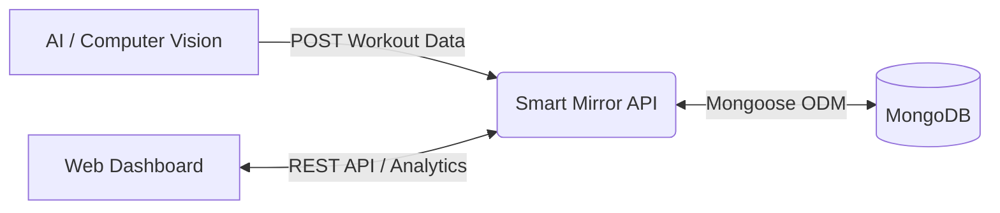

# Smart Mirror API – SCU


Backend service for the **Smart Mirror System – SCU**. This API provides secure authentication, workout session management, analytics processing, and cloud-ready RESTful endpoints.

It serves as the **core data and logic layer** connecting the AI Computer Vision module, the User Dashboard, and the Database.

---

## 📑 Table of Contents
- [Architecture](#-architecture)
- [Tech Stack](#-tech-stack)
- [Getting Started](#-getting-started)
  - [Prerequisites](#prerequisites)
  - [Environment Variables](#environment-variables)
  - [Installation (Local)](#installation-local)
  - [Installation (Docker)](#installation-docker)
- [API Documentation](#-api-documentation)
- [Deployment](#-deployment)
- [Team](#-team)

---

## 🏗 Architecture

The system follows a centralized data flow where the API acts as the bridge between the AI hardware and the user frontend.



> **Note:** The API aggregates real-time analytics from the AI Mirror and serves them to the Dashboard.

---

## 🛠 Tech Stack

| Component | Technology |
| :--- | :--- |
| **Runtime** | Node.js + Express |
| **Database** | MongoDB + Mongoose |
| **Auth** | JWT (JSON Web Tokens) |
| **Architecture** | MVC Pattern |
| **Deployment** | Docker, AWS EC2, Render |

---

## 🚀 Getting Started

### Prerequisites
* **Node.js** (v18 or higher)
* **MongoDB** (Local or Atlas URI)
* **Docker** (Optional, for containerized run)

### Environment Variables
Create a `.env` file in the root directory.

**Option A: For Local Development**
```bash
PORT=3000
MONGO_URI=mongodb://localhost:27017/smart-mirror
JWT_SECRET=your_super_secret_key
JWT_EXPIRES=7d
```

**Option B: For Docker Compose**
```bash
PORT=3000
# Connects to the service named 'smart-mirror-mongo' in docker-compose.yml
MONGO_URI=mongodb://smart-mirror-mongo:27017/smart-mirror
JWT_SECRET=your_super_secret_key
JWT_EXPIRES=7d
```

---

### Installation (Local)

1.  **Clone the repository**
    ```bash
    git clone [https://github.com/MohamedFouad71/smart-mirror-api.git](https://github.com/MohamedFouad71/smart-mirror-api.git)
    cd smart-mirror-api
    ```

2.  **Install dependencies**
    ```bash
    npm install
    ```

3.  **Run the server**
    ```bash
    # Run in development mode (with nodemon)
    npm run dev
    
    # Run in production mode
    npm start
    ```

### Installation (Docker)

1.  **Configure the `.env` file** (See "Option B" above).
2.  **Build and Run**
    ```bash
    docker-compose up --build
    ```

---

## 📡 API Documentation

### 1. Authentication

| Method | Endpoint | Description |
| :--- | :--- | :--- |
| `POST` | `/api/auth/register` | Register a new user account. |
| `POST` | `/api/auth/login` | Login and receive a JWT Bearer token. |

### 2. Sessions (Workouts)

| Method | Endpoint | Description |
| :--- | :--- | :--- |
| `POST` | `/api/sessions` | **(AI Mirror Only)** Upload completed workout data. |
| `GET` | `/api/sessions/latest` | Retrieve the most recent workout session. |

**Example: AI Mirror Upload Payload**
```json
{
  "exerciseType": "squat",
  "reps": 18,
  "formScore": 82,
  "mistakes": [
    { "type": "knees_in", "count": 3 }
  ],
  "ts": "2026-02-10T18:00:00Z"
}
```

### 3. Analytics

| Method | Endpoint | Description |
| :--- | :--- | :--- |
| `GET` | `/api/analytics/summary` | Get aggregated stats. Query param: `?range=7d` |

**Example: Analytics Response**
```json
{
  "ok": true,
  "range": "7d",
  "totalSessions": 1,
  "totalReps": 18,
  "avgFormScore": 82,
  "topMistakes": [
    { "type": "knees_in", "count": 3 }
  ]
}
```

---

## ☁️ Deployment

The application is cloud-native and designed for scalability.

* **AWS:** Dockerized service hosted on EC2 with CI/CD via GitHub Actions.
* **Database:** Managed MongoDB Atlas instance.
* **Scalability:** Stateless architecture allows horizontal scaling.

---

## 👥 Team – SCU Smart Mirror

| Role | Focus Area |
| :--- | :--- |
| **Backend Engineering** | API, Database, Security |
| **AI & Computer Vision** | Pose Estimation, Feedback Logic |
| **Frontend Dashboard** | React/Next.js, Data Visualization |
| **Embedded Systems** | Hardware Integration, Mirror Display |
| **DevOps & Cloud** | CI/CD, Docker, AWS Infrastructure |

---

## 📝 License

**Educational Project – SCU Graduation Project.**
All rights reserved.